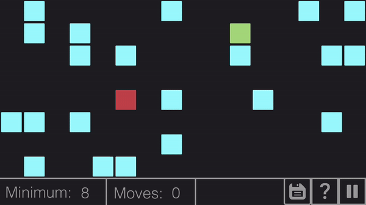
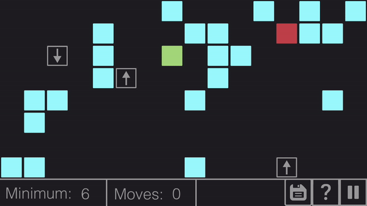
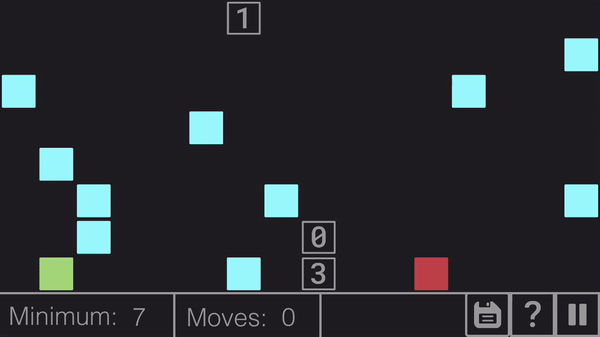
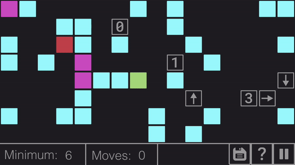
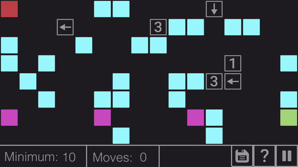

`Slide the Box`
===============

A grid-based iOS puzzle game. The aim is to reach the `red block` by sliding the `green box` (you) in order to navigate the maze. Levels are randomly generated and are always completable, I promise! If you don't beleive me then you can use the `hint` button (question mark) to help you find your way.

Make the levels more challenging by introducing `arrow tiles` which change your direction when you slide onto them.

Or introduce an extra dimension with `number tiles` which allow you to stop `x` spaces after the tile.

Finally, if you're really looking for a challenge then add `enemies` who hunt you down every slide you make. Get to the `red block` before they get to you!

However, if they catch you then it's game over!

Requirements
------- 

Operating system: `MacOS`
Xcode version: `10.0`
iPhone/iPad

Install
-------

Open `Slide the Box.xcodeproj` in Xcode.
Click the `Build` icon in the top left corner. This will compile the app, install it inside an iPhone emulator, and run the app.
To install on a physical device, connect your iPhone/iPad to your computer and select your device from the drop down list in the top left corner of the Xcode interface, then `Build`.

